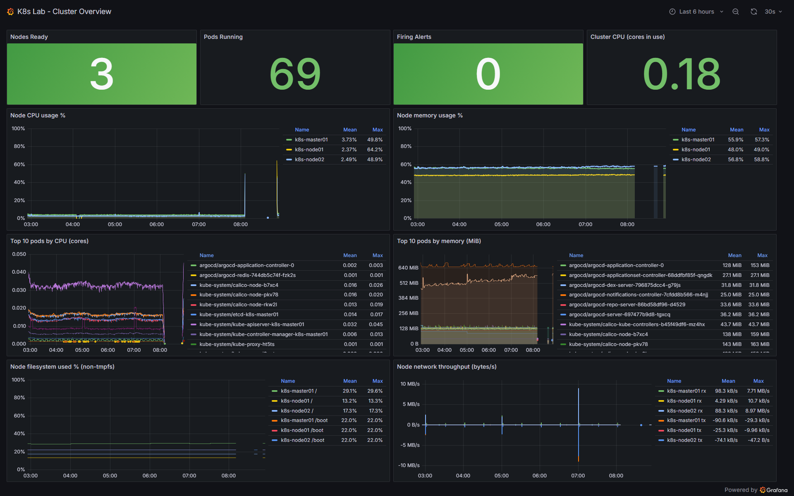
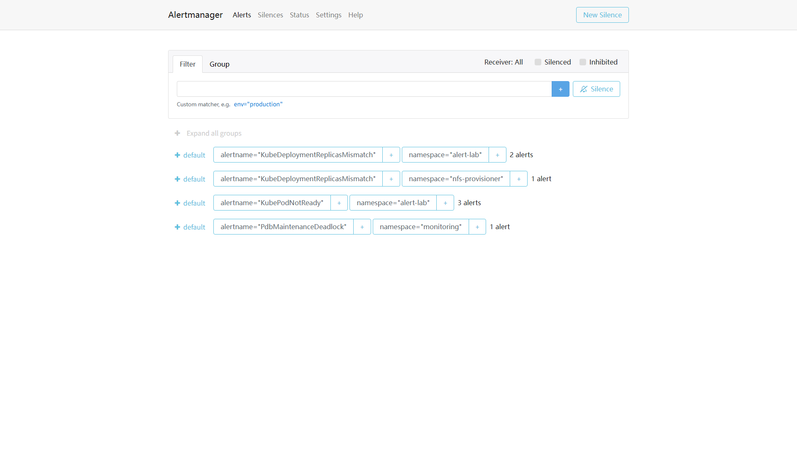
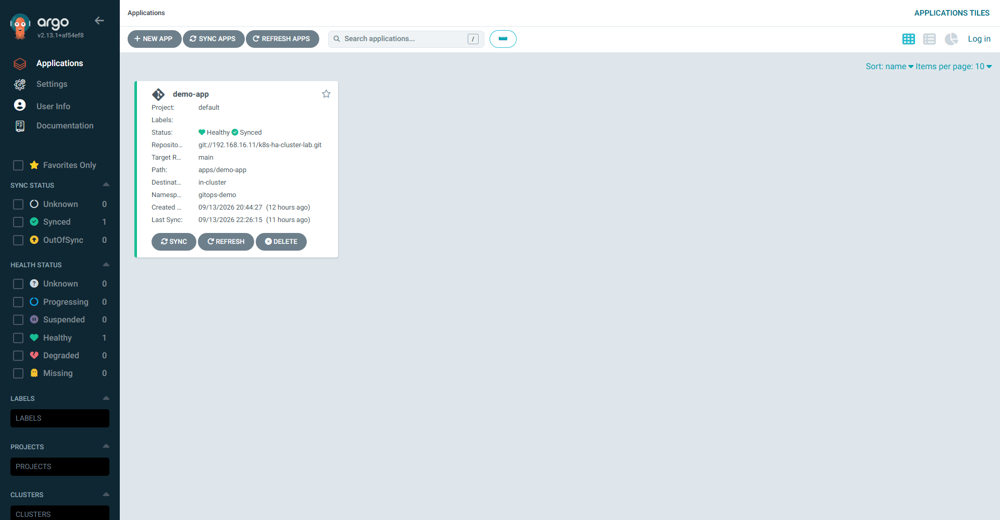
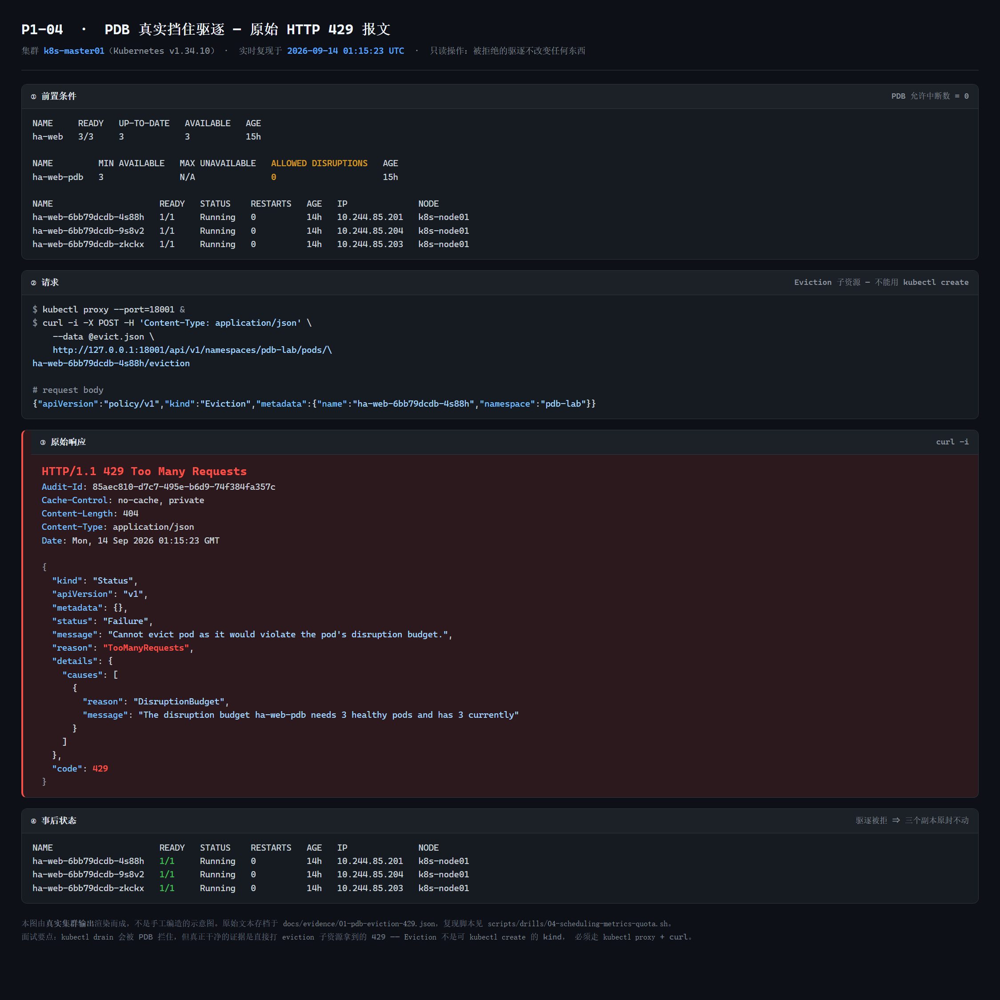
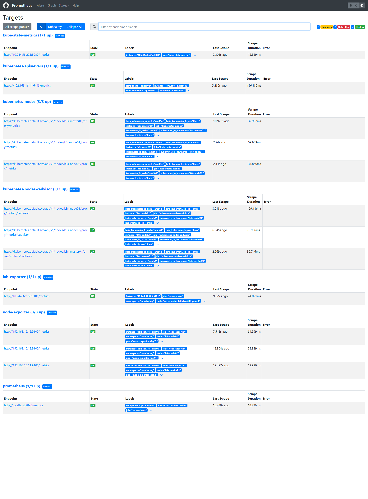
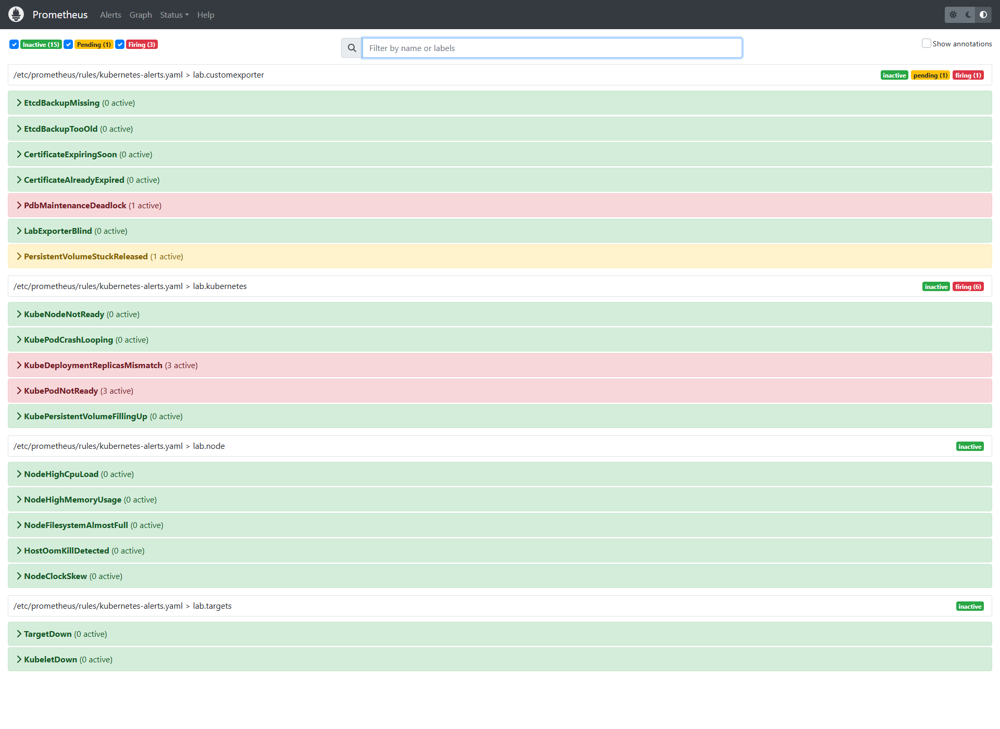
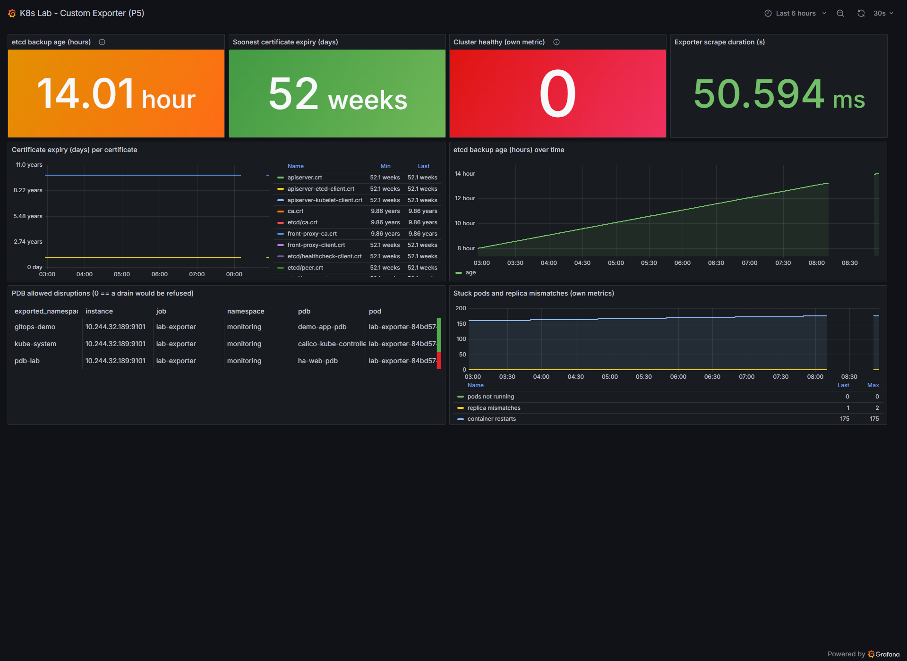
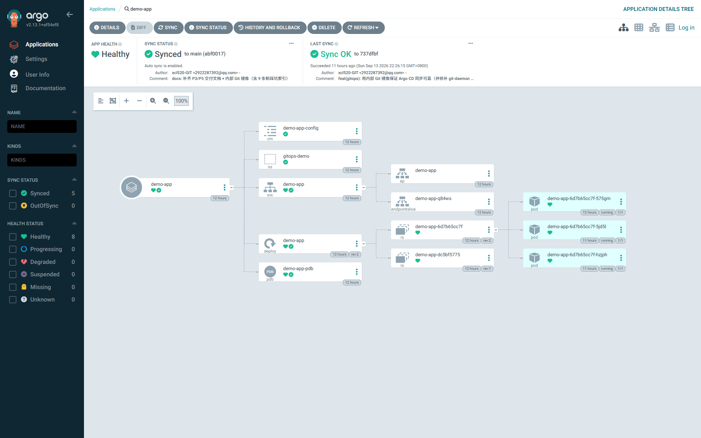

# k8s-ha-cluster-lab

三节点 Kubernetes 集群，跑在本地 VMware 的 Rocky Linux 虚拟机上（每台 4C/4G）。
从空机器用 kubeadm 搭起，然后做了一轮运维加固、监控告警、GitOps 交付，
最后自己写了一个 Prometheus exporter 补上监控盲区。

每个结论都有实测数据，原始输出放在 `docs/evidence/`。


---

## 环境

| 主机名 | IP | 角色 |
|---|---|---|
| k8s-master01 | 192.168.16.11 | control-plane / etcd / NFS server / 内部 git-daemon |
| k8s-node01 | 192.168.16.12 | worker |
| k8s-node02 | 192.168.16.13 | worker |

| 组件 | 版本 | 说明 |
|---|---|---|
| Kubernetes | v1.34.10 | kubeadm 部署 |
| etcd | v3.6.5 | 静态 Pod，单节点 |
| 容器运行时 | containerd 2.2.6 | SystemdCgroup；由 cri-dockerd 在线迁移而来 |
| CNI | Calico v3.25.0 | IPIP Always，Pod 网段 10.244.0.0/16 |
| 监控 | Prometheus 2.54.1 / Alertmanager 0.27 / Grafana 11.2 | 手写清单，未用 Helm |
| GitOps | Argo CD v2.13.1 | 从内部 Git 镜像同步 |
| 存储 | NFS `192.168.16.11:/data/nfs` | `nfs-dynamic` 动态供给 + `nfs-storage-class` 静态 |
| 系统 | Rocky Linux 10.2，内核 6.12，cgroup v2 | |

Service 网段 10.10.0.0/12，ClusterDNS 10.0.0.10。

---

## 做了什么，以及结果

先跑 `scripts/audit-cluster.sh` 找出集群的 8 个问题，然后逐项处理并验证。

| # | 审计发现的问题 | 严重度 | 处理结果 |
|---|---|---|---|
| 1 | 没有任何 etcd 备份机制 | 致命 | 备份脚本 + 校验 + 轮转；恢复 RTO **37 秒** |
| 2 | 未装 metrics-server，`kubectl top` 不可用 | 高 | 已部署，`kubectl top` 可用 |
| 3 | 零 NetworkPolicy，Pod 之间全通 | 中 | 三阶段隔离验证（全通 → 全断 → 精确放行） |
| 4 | `vm.swappiness = 60` | 中 | 调至 1 并持久化 |
| 5 | 业务 Pod 无 requests/limits | 中 | ResourceQuota + LimitRange |
| 6 | 容器运行时用已淘汰的 cri-dockerd | 中 | 在线迁到 containerd，**零掉负载** |
| 7 | 无 PodDisruptionBudget | 低 | 补上 PDB，并拿到驱逐被拒的 429 报文 |
| 8 | 无 Ingress Controller | 低 | 用 NodePort 替代，暂不做 |

各项目的关键数字：

| 项目 | 结果 | 实现 |
|---|---|---|
| etcd 备份与灾难恢复 | **RTO 37 秒**，5/5 对象 UID 一致 | `scripts/backup/`、`scripts/drills/01-etcd-drill.sh` |
| 节点故障与优雅驱逐 | 优雅驱逐 **31 秒**；硬故障 **331 秒**后驱逐 | `scripts/drills/02-node-failure.sh` |
| 证书轮换与内核调优 | 证书 315d → **364d**；4 项内核参数 | `scripts/drills/03-cert-and-tuning.sh` |
| 调度 / 配额 / PDB | `kubectl top` 可用；PDB 返回 **HTTP 429** | `scripts/drills/04-scheduling-metrics-quota.sh` |
| NetworkPolicy 隔离 | 三阶段连通矩阵 | `scripts/drills/05-networkpolicy.sh` |
| 存储全生命周期 | 动态供给、RWX、Retain；**冷热分层 22.0 MB → 60.0 KB** | `scripts/drills/06-storage.sh` |
| CRI 迁移 | 三节点全部 `containerd://2.2.6`，零掉负载 | `scripts/drills/07-cri-migrate.sh` |
| 监控告警栈 | **13/13 抓取目标 UP**，19 条规则，真实故障触发 5 条告警 | `manifests/monitoring/`、`scripts/monitoring/` |
| GitOps 交付 | git 改一行自动下发；手工漂移 **2–3 秒**被收敛 | `argocd/`、`scripts/gitops/` |
| 自研 Go Exporter | **584 行，零外部依赖**，27 个指标族 | `exporter/main.go`、`manifests/exporter/` |

### 几个值得展开说的点

**etcd 恢复是逐对象校验过的**

恢复后对比 5 个对象的 `metadata.uid`，全部与删除前一致 —— 证明恢复的是原对象，
不是重新 apply 了一遍长得一样的 YAML。

**PDB 挡住驱逐这件事做成了可复现的**

```
HTTP/1.1 429 Too Many Requests
{"message":"Cannot evict pod as it would violate the pod's disruption budget.",
 "reason":"TooManyRequests","code":429}
```

直接用 `kubectl proxy` + POST `eviction` 子资源拿到原始报文（`Eviction` 不是可以用
`kubectl create` 提交的 kind）。原始报文见 `docs/evidence/01-pdb-eviction-429.json`。

**冷热分层先校验再删源**

`/data/hot` 里 5 个可压缩日志（22.0 MB 占用）压缩归档进 `/data/cold` 后只有 60.0 KB。
归档后先跑 `gzip -t` 校验通过，才允许清理源文件 —— 不是先删后压。

**CRI 迁移的顺序是踩过坑才写对的**

`systemctl stop kubelet` 不会杀掉已经在跑的容器。所以必须先排水、把镜像从 docker
搬到 containerd（两边镜像存储是独立的目录）、显式清理旧容器、确认 6443/2379/2380
端口真的释放，才能改 kubelet 的 runtime endpoint。三节点逐个做，全程零掉负载。

**受限网络下的 GitOps**

实测这个环境访问 github.com 只有 40–80% 成功率，Argo CD 会卡在 `sync=Unknown`。
于是在控制平面起了一个内部 Git 镜像（`git-daemon`，9418）：

```
内部镜像 git://192.168.16.11/k8s-ha-cluster-lab.git   10/10 成功
github.com 同期                                        4/10 成功
```

公开仓库仍是唯一真相源，工作站上一次 push 推两个远端，集群从镜像同步。

---

## 实际效果

**Grafana 总览看板**（10 个面板全部有数据）



**Alertmanager** —— 故意弄坏一个 Deployment（必然 CrashLoop）和一个调度不上的
Deployment 之后收到的告警分组



**Argo CD** —— demo-app 处于 Synced + Healthy



**PDB 拒绝驱逐的原始 429 报文**



<details>
<summary>另外几张</summary>

Prometheus `/targets`，13/13 UP：



告警在 Prometheus 侧同样处于 firing 状态：



自研 exporter 的看板（备份年龄、证书剩余天数、PDB 死锁）：



Argo CD 资源树：



</details>

---

## 集群架构

```
                     192.168.16.0/24  (VMware NAT)

   ┌─────────────────────┐   ┌─────────────────────┐   ┌─────────────────────┐
   │   k8s-master01      │   │    k8s-node01       │   │    k8s-node02       │
   │   192.168.16.11     │   │   192.168.16.12     │   │   192.168.16.13     │
   │   control-plane     │   │   worker            │   │   worker            │
   ├─────────────────────┤   ├─────────────────────┤   ├─────────────────────┤
   │ kube-apiserver      │   │ kubelet             │   │ kubelet             │
   │ kube-scheduler      │   │ kube-proxy          │   │ kube-proxy          │
   │ kube-controller-mgr │   │ calico-node         │   │ calico-node         │
   │ etcd  (static Pod)  │   │ node-exporter       │   │ node-exporter       │
   │ containerd 2.2.6    │   │ demo-app (GitOps)   │   │ prometheus/grafana  │
   │ NFS server /data/nfs│   │                     │   │                     │
   │ git-daemon  :9418   │   │                     │   │                     │
   └─────────────────────┘   └─────────────────────┘   └─────────────────────┘
        │ 污点 node-role.kubernetes.io/control-plane:NoSchedule
        └────────────────── Calico IPIP (Always) ──────────────────┘
```

服务访问入口（NodePort）：

| 服务 | 地址 |
|---|---|
| Grafana | http://192.168.16.11:30300 |
| Prometheus | http://192.168.16.11:30090 |
| Alertmanager | http://192.168.16.11:30093 |
| Argo CD UI | http://192.168.16.11:30333 |
| demo-app | http://192.168.16.11:30080 |

---

## 仓库结构

```
.
├── apps/demo-app/                    GitOps 演示应用（kustomize）
├── argocd/application-demo-app.yaml  Argo CD Application
├── exporter/
│   ├── main.go                       自研 exporter（584 行，仅标准库）
│   └── go.mod
├── manifests/
│   ├── monitoring/                   监控栈清单 00~08a（手写，未用 Helm）
│   ├── exporter/                     RBAC / 构建 PVC / 构建 Job / 部署
│   └── argocd/install.yaml           Argo CD v2.13.1 官方清单
├── scripts/
│   ├── 00-health-check.sh            开机自检（只读，12 项）
│   ├── audit-cluster.sh              集群审计
│   ├── backup/                       etcd 备份、快照校验
│   ├── drills/                       各演练脚本（07 含回滚脚本）
│   ├── monitoring/                   监控栈安装、告警故障注入
│   ├── gitops/                       Argo CD 安装、取证、内部 Git 镜像
│   └── exporter/                     exporter 构建部署
├── docs/
│   ├── architecture.md               集群架构与审计结论
│   ├── troubleshooting.md            排障记录
│   ├── evidence/                     实测原始输出
│   └── images/                       README 引用的截图
├── Makefile
└── LICENSE
```

---

## 怎么跑起来

### 前置条件

- 3 台 Rocky Linux 9/10 虚拟机（各 4C4G），静态 IP，主机名可互相解析
- kubeadm 部署的集群（v1.28+，本项目在 v1.34.10 上验证）
- 能 SSH 到三个节点

### 健康自检（只读，不改任何东西）

```bash
bash scripts/00-health-check.sh
```

会打印节点与运行时、异常 Pod、监控栈、存储、`kubectl top`、NetworkPolicy、
告警规则数、内核调优、证书剩余天数、备份新鲜度等项目。

### 各项目脚本

```bash
bash scripts/drills/01-etcd-drill.sh                # etcd 备份恢复（RTO 实测）
bash scripts/drills/02-node-failure.sh              # 节点故障与驱逐
bash scripts/drills/03-cert-and-tuning.sh           # 证书轮换 + 内核调优
bash scripts/drills/04-scheduling-metrics-quota.sh  # 调度 / 配额 / PDB
bash scripts/drills/05-networkpolicy.sh             # 三阶段隔离矩阵
bash scripts/drills/06-storage.sh                   # 存储全生命周期 + 冷热分层
bash scripts/drills/07-cri-migrate.sh worker        # CRI 迁移（破坏性，先读脚本头部）
bash scripts/monitoring/install-monitoring.sh /tmp/monitoring
bash scripts/gitops/01-install-argocd.sh
kubectl apply -f argocd/application-demo-app.yaml
bash scripts/exporter/01-build-and-deploy.sh /tmp/exporter
```

注意：`scripts/drills/07-cri-migrate.sh` 会动控制平面，执行前先做一次 etcd 备份，
并确认能物理访问虚拟机。

---

## 已知限制

写清楚没做什么、哪里不够，比只讲成绩有用。

- **etcd 是单节点**，没有冗余。资源只够三台的 4C4G，做 3 控制平面就没有 worker 了。
  生产上第一步应该是 3 个 etcd 成员 + 独立数据盘 + 异地快照。
- **备份只存在控制平面本地** `/var/backups/etcd/`。能救误删命名空间、误删 CRD
  和数据目录损坏，但救不了整块盘坏或虚拟机丢失。生产需要推到对象存储并加监控。
- **`nf_conntrack_max` 没调生效**。配置写进了 `sysctl.d`，但 `systemd-sysctl`
  执行时 `nf_conntrack` 模块还没加载，键不存在，写入被静默跳过；模块加载后用回了
  默认值 131072。正确做法是在 `modprobe.d` 里配 `hashsize`。这一项尚未收尾。
- **未抓 etcd / scheduler / controller-manager 的指标**。kubeadm 默认把它们绑在
  127.0.0.1，从 Pod 网络不可达；要抓就得开 hostNetwork 或者把控制平面 PKI 搬进
  监控命名空间，后者是明显的安全降级，所以放弃了。这几项用自研 exporter 的
  「备份新鲜度」间接覆盖。
- **Alertmanager 的 receiver 是空的**，只在 UI 里看，没有接通知渠道。
- **没有 Ingress Controller**，全部用 NodePort。
- **exporter 用全量 list 读 Pod**，集群大了会有性能问题，应该改成分页或 informer。
- **集群内构建 exporter** 是环境受限下的权宜方案（没有可用的镜像仓库），
  生产应该由 CI 构建镜像。
- **NFS 存储是单点**，没有快照，也不做拓扑感知。

---

## License

MIT。可以自由参考、复制脚本，但请把里面的 IP、口令、路径换成你自己的。
